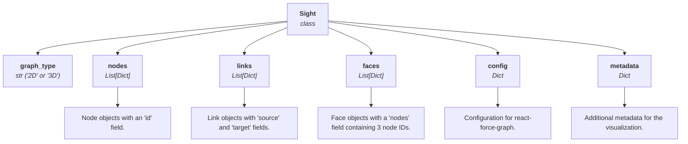

# Zen Sight

Zen Sight is a Python package for interactive visualization of simplicial complexes and graphs.


---
## Key Features

- **Interactive 2D & 3D Visualizations**: Render simplicial complexes and graphs using `react-force-graph` and `Three.js`.
- **Node & Link Data**: Associate metadata with nodes and links, and use it to drive visualization properties like color and size.
- **Advanced Selection Tools**: Use single, multi-select, and lasso tools to select and inspect nodes.
- **Manipulation**: Perform graph operations like cutting and duplicating nodes.
- **Timeline & Replay**: Track your operations and replay them to understand the evolution of the graph.
- **Built-in Adapters**: Integration with other libraries: `zen-mapper` and `NetworkX`.

---
## Installation

Zen Sight is available on PyPI:

```bash
pip install zen-sight
```

---

## Quick Start

### Creating a Simple Graph

Here's how to create and visualize a simple graph with a 2-simplex (a face).

```python
from zen_sight import Sight

def create_simplicial_complex():
    """Create a graph with a hexagonal pattern and a central node."""
    nodes = []
    positions = [
        (0, 0), (1, 0), (0.5, 0.87), (-0.5, 0.87),
        (-1, 0), (-0.5, -0.87), (0.5, -0.87),
    ]

    for i, (x, y) in enumerate(positions):
        nodes.append({
            "id": str(i),
            "name": f"Node {i}",
            "x": x * 50,
            "y": y * 50,
            "z": 0,
            "group": "center" if i == 0 else "outer",
        })

    links = []
    # Connect center to all outer nodes
    for i in range(1, 7):
        links.append({"source": "0", "target": str(i)})

    # Connect outer nodes to form a ring
    for i in range(1, 7):
        next_i = (i % 6) + 1
        links.append({"source": str(i), "target": str(next_i)})

    # Define a 2-simplex (a triangular face)
    faces = [("0", "1", "2")]

    return nodes, links, faces

def main():
    sight = Sight()
    nodes, links, faces = create_simplicial_complex()

    sight.set_nodes(nodes)
    sight.set_links(links)
    sight.set_faces(faces)

    sight.set_config({
        "nodeAutoColorBy": "group",
        "nodeRelSize": 4,
        "nodeLabel": "name",
        "nodeOpacity": 1,
        "linkColor": "#000000",
        "linkWidth": 2,
        "faceFillColor": "rgba(52, 152, 219, 0.3)",
        "faceStrokeColor": "rgba(52, 152, 219, 0.5)",
    })

    sight.show()

if __name__ == "__main__":
    main()
```

### `zen-mapper` Integration

Zen Sight provides a convenient adapter for visualizing `zen-mapper` results.

```python
import zen_mapper as zm
from zen_sight.adapters import vis_zen_mapper
import numpy as np
from sklearn.decomposition import PCA
from sklearn.cluster import DBSCAN

def circle(n=100):
    """Generate points on a circle."""
    theta = np.linspace(0, 2 * np.pi, n)
    x = np.cos(theta)
    y = np.sin(theta)
    return np.c_[x, y]

def main():
    data = circle()
    proj = PCA(n_components=1).fit_transform(data)
    result = zm.mapper(
        data=data,
        cover_scheme=zm.Width_Balanced_Cover(percent_overlap=0.2, n_elements=6),
        projection=proj,
        dim=1,
        clusterer=zm.sk_learn(DBSCAN(eps=0.2)),
    )

    # Visualize the mapper result
    vis_zen_mapper(result, data=data, projection=proj)

if __name__ == "__main__":
    main()
```

---

## The `Sight` Class

The `Sight` class is the main entry point for creating visualizations. It holds the graph data, configuration, and metadata.


```mermaid
graph TD
    A["<b>Sight</b><br/><i>class</i>"] --> B["<b>graph_type</b><br/><i>str ('2D' or '3D')</i>"]
    A --> C["<b>nodes</b><br/><i>List[Dict]</i>"]
    A --> D["<b>links</b><br/><i>List[Dict]</i>"]
    A --> E["<b>faces</b><br/><i>List[Dict]</i>"]
    A --> F["<b>config</b><br/><i>Dict</i>"]
    A --> G["<b>metadata</b><br/><i>Dict</i>"]

    C --> C1["Node objects with an 'id' field."]
    D --> D1["Link objects with 'source' and 'target' fields."]
    E --> E1["Face objects with a 'nodes' field containing 3 node IDs."]
    F --> F1["Configuration for react-force-graph."]
    G --> G1["Additional metadata for the visualization."]
```

### Data Structures

- **Nodes**: A list of dictionaries, where each dictionary represents a node. The `id` field is required.
- **Links**: A list of dictionaries, where each dictionary represents a link. The `source` and `target` fields are required and should correspond to node IDs.
- **Faces**: A list of dictionaries or tuples. If tuples are provided, they are converted to dictionaries with a `nodes` field. Each face represents a 2-simplex.

---

## How It Works

Zen Sight is built with a Python backend and a React frontend:

- **Backend**: A Flask server that provides a simple API to the frontend. It serves the React application and handles data requests.
- **Frontend**: A React application that renders the interactive visualizations using `react-force-graph`. It communicates with the backend to fetch data and save operations.

---

## Customization

You can customize the appearance and behavior of the graph by passing a configuration dictionary to the `set_config` method of the `Sight` class. This configuration is passed directly to `react-force-graph`.

For a complete list of available options, see the [react-force-graph documentation](https://github.com/vasturiano/react-force-graph#api-reference).

---

## Development

To contribute to Zen Sight, you'll need to set up the development environment.

### Prerequisites

- Python 3.8+
- Node.js and npm

### Setup

1.  **Clone the repository:**

    ```bash
    git clone https://github.com/Jamiller137/zen-sight.git
    cd zen-sight
    ```

2.  **Install Python dependencies:**

    ```bash
    pip install -e .
    ```

3.  **Install frontend dependencies:**
    ```bash
    cd src/frontend
    npm install
    ```
#### Flake
Zen-Sight also comes with a nix flake:
```bash
git clone https://github.com/Jamiller137/zen-sight
cd zen-sight
nix develop
```
Will put you into a shell with uv with zen-sight, zen-mapper, and dependencies installed.

### Building the Frontend

To create a production build of the frontend, run the following command from the `src/frontend` directory:

```bash
npm run build
```

This will generate the static assets in the `src/frontend/dist` directory. The `build_frontend.py` script handles the building and copying of these assets to the `src/zen_sight/static` directory. The python package uses the files in `zen_sight/static` so if making changes to the frontend you will have to use `build_frontend.py` to see changes when running the package.

---
---

## Future Work

- **Bug Fixes & API Refinements**: Improve stability and finalize the API.
- **More Adapters**: Add support for other libraries like `GUDHI`.
- **Higher-Order Simplices**: Add support for visualizing 3-simplices (tetrahedra).
- **Filtration Visualizer**: Create a tool for visualizing filtrations.
- **Export Options**: Add a feature to export visualizations as images or videos.
- **VR/AR Support**: Explore the possibility of rendering visualizations in virtual and augmented reality.

---

