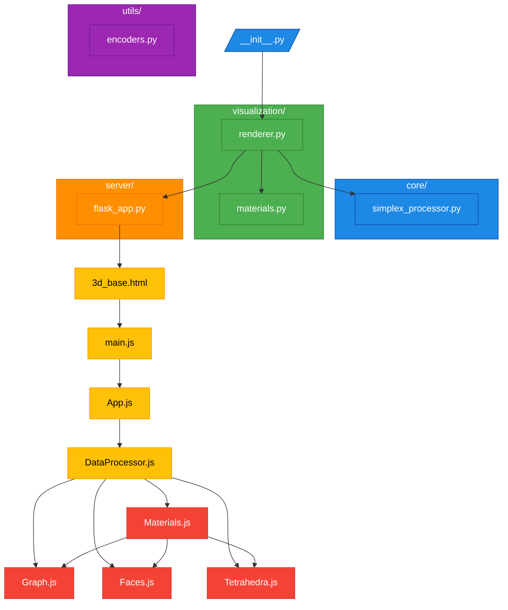

# SimplexTree Visualizer

## Overview
Provides a Python API for converting SimplexTrees into interactive 3D visualizations. The project was updated with a more modular, maintainable architecture. But, zen-sight is still a work in progress. Currently it depends on a custom implementation of ZenMapper which uses a SimplexTree datastructure -- at some point the main branch of zen mapper will be updated but for now this is just for me.

## Structure



## Components

### Python Backend
- `SimplexTreeVisualizer` (renderer.py) : Core class that converts simplicial complexes into graph data
    - Orchestrates the visualization pipeline
    - Delegates materials handling to MaterialManager
    - Prepares data for rendering

- `MaterialManager` (materials.py) : Manages elements' visual properties
    - Stores and retrieves properties for elements
    - Provides defaults when customizations aren't provided

### Core Application Structure
- `3d_base.html`: HTML template for the visualization with base structure and JS imports
- `main.js`: Entry point script that initializes the application
- `App.js`: Main application component that coordinates all visualization elements
- `DataProcessor.js`: Transforms the raw JSON data from Python into proper format

### Visualization Components
Served by `flask_app.py`.
- `Materials.js`: Manages material definitions and properties for all 3D objects
    - Handles color, opacity, wireframe, and other properties
- `Graph.js`: Handles vertices and edges of the simplicial complex
    - Vertices customizable with color, size, opacity, tooltip, label, and shape
    - Links customizable with color, width, opacity, and dashed properties
- `Faces.js`: Manages triangular face representation and interactions
    - Customizable with color, opacity, wireframe, and side properties
- `Tetrahedra.js`: Handles tetrahedral simplices rendering
    - Customizable with color, opacity, wireframe, and showEdges options

### Customization Options
Customization options come from [THREE.js](https://threejs.org/manual/#en/materials)
#### Vertices/Nodes:
```python
visualizer.set_vertex_material(vertex_id, {
    "color": 0xFF0000,                  # Hex color code
    "size": 8,                          # Node size
    "opacity": 0.9,                     # Transparency level
    "tooltip": "Important vertex",      # Hover text
    "label": "v1",                      # Text label
    "shape": "sphere"                   # Node shape type
})
```

#### Edges/Links:
```python
visualizer.set_edge_material(edge_id, {
    "color": 0x005ebb,                  # Default 0x005ebb
    "width": 2,                         # Line thickness
    "opacity": 0.8,                     # Default 0.8
    "dashed": False                     # Boolean for dashed lines
})
```

#### Faces:
```python
visualizer.set_face_material(face_id, {
    "color": 0x3366CC,                  # Default 0x3366CC
    "opacity": 0.4,                     # Default 0.4
    "wireframe": False,                 # Boolean toggle
    "side": "double"                    # Rendering side ('double' by default)
})
```

#### Tetrahedra:
```python
visualizer.set_tetrahedron_material(tetra_id, {
    "color": 0x99BBEE,                  # Default 0x99BBEE
    "opacity": 0.2,                     # Default 0.2
    "wireframe": False,                 # Boolean toggle
    "showEdges": True                   # Boolean to highlight edges
})
```

## Dependencies
- **THREE.js**: Core 3D rendering library (```three.min.js```)
- **3D-Force-Graph**: Force-directed graph layouts in 3D space (```3d-force-graph.min.js```)
- **Flask** >= 3.1.0: Python web framework for serving the visualization
- **Jinja2** >= 3.1.6: Template engine for HTML generation
- **NetworkX** >= 3.4.2: Graph manipulation library
- numpy
